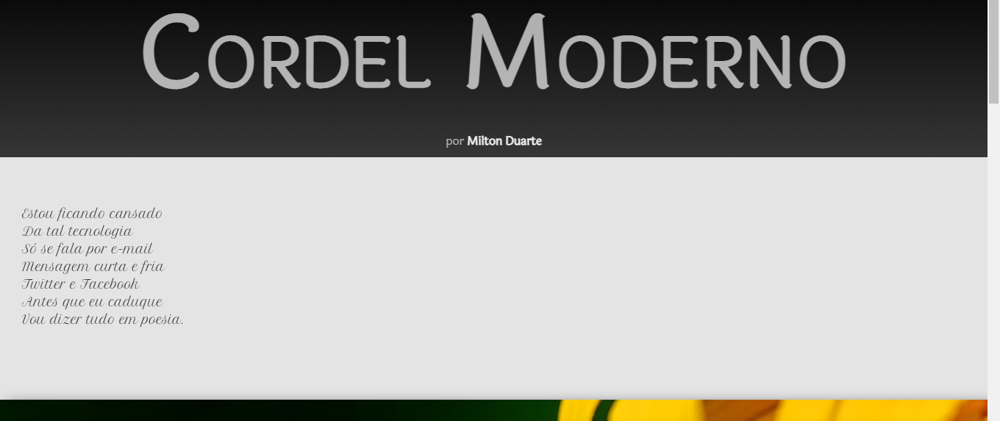

<h1> Redes - Sociais</h1>

este projeto tem como texto principal uma história de cordel escrita por milton duarte

<h2>Tecnologias usadas neste site </h2>

 para a construção foi utilizada somente HTML5 e CSS3, muito provavelmente ele sofrera algum tipo de alteração futura 

<h3> exemplo de como o projeto fica em uma tela de notebook</h3>

<h3>link do projeto</h3>

<a href="https://lucaskawatoko.github.io/cordel/">https://lucaskawatoko.github.io/cordel/</a>